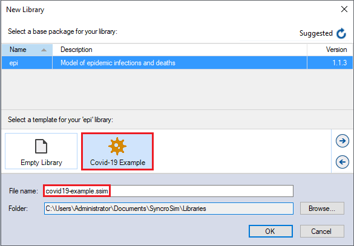

# Getting started with **Epi**

## Quickstart Tutorial: a COVID-19 model example

This quickstart tutorial will introduce you to the basics of working with **Epi**. The steps include:
 
* Installing Epi
* Creating a new Epi Library
* Viewing model inputs and outputs

## **Step 1: Install Epi**
**Epi** is a Package within the <a href="https://syncrosim.com/download/" target="_blank">Syncrosim</a> simulation modeling framework; as such, **Epi** requires that the **SyncroSim** software be installed on your computer. Download and install <a href="https://syncrosim.com/download/" target="_blank">**the latest version of SyncroSim**</a> here. If you choose to run **Epi**, you will also need to install <a href="https://www.r-project.org/" target="_blank">R version 4.0.0</a> or higher, and the add-on package, <a href="https://github.com/ApexRMS/epiModelVocVaccine" target="_blank">epiModelVocVaccine</a>.
> **Note:** The **Epi** package includes a template Library, **covid19-example.ssim**, that contains example inputs and outputs. Installation of R and the add-on epiModelVocVaccine package is not required to view the template Library.

Once all required programs are installed, open **SyncroSim**, select **File -> Packages... -> Install...**, select the **epi** package and click OK.

## **Step 2: Create a new Epi Library**
Having installed the **Epi** Package, you are now ready to create your first SyncroSim Library. A Library is a file (with extension *.ssim*) that contains all of your model inputs and outputs. The format of each Library is specific to the Package for which it was initially created. To create a new Library, choose **New Library...** from the **File** menu.
 

 
In this window:
 
* Select the row for **epi**. Note that as you select a row, the list of **Templates** available and suggested **File name** for that base package are updated.
* Select the **Covid-19 Example** Template.
* Optionally type in a new **File name** for the Library (or accept the default); you can also change the target **Folder** using the **Browse...** button.

When you are ready to create the Library file, click **OK**. A new Library will be created and loaded into the Library Explorer.

## **Step 3: Review the model inputs and outputs**
The contents of your newly created Library are now displayed in the Library Explorer. Model inputs in SyncroSim are organized into Scenarios, where each Scenario consists of a suite of values, one for each of the Model's required inputs.

Because you chose the **Epi** template when you created your Library, your Library already contains three scenarios:
* 1: Data
* 2: Forecast - Status Quo
* 3: Forecast - Additional Vaccines
 

 
The **Data** Scenario contains the input data, which are COVID-19 cases data. These data are then fed into the two forecast Scenarios, **Forecast - Status Quo** and **Forecast - Additional Vaccines**, which each contain model parameters for forecasting future cases.  

* In the Library Explorer, select the Scenario named **Data**
* Right-click on the Scenario and Choose **Properties** from the drop-down menu to vew the details of the Scenario

This opens the Scenario Properties window. The first tab in this window, called **General**, contains three datasheets. The first, **Summary**, displays some general information for the Scenario. The second, **Pipeline**, allows the user to select the run order of the inputs in the model. Finally, the **Datafeeds** datasheet displays a list of all data sources. In this case, there is only one data source, the **Data - All Data** datasheet.
 

 
The **Data - All Data** datasheet contains data of daily and cumulative COVID-19 cases for 195 countries from 2020-01-22 to 2021-06-29. These data were downloaded from the Johns Hopkins University COVID-19 Database and have been smoothed to remove seasonal effects. 
 

 
>**Note:** Data can be downloaded and smoothed from within Syncrosim using the Epi Base Package, along with two additional add-on Packages - the **World COVID-19 Data** Package and the **Remove Seasonal Effects** Package. If you would like to download the latest available COVID-19 data to generate your own forecasts, download and install both of these packages following the same steps described above for installing the Epi Base Package.  

Open the **Forecast - Status Quo** Scenario and navigate to **Pipeline** under the **General** tab. This is where any models that the input data will be passed to is listed. In this case, only one model is listed - the **VOC + Vaccine Model: Run Model**. 
 

 
Next, click on the **Models** tab and navigate to **Run Settings** under the **Inputs** drop-down. This is where parameters for the **VOC + Vaccine Model: Run Model** are defined. 
 

 
Further down in the **Inputs** drop-down menu is the datasheet, **Vaccination Rates**. This datasheet contains historic rates of vaccination beginning in 2020-12-29, as well as current and future rates (relative to the data provided in this template library). 
 

 
Open the **Forecast - Additional Vaccines** Scenario and explore the datasheets available in each tab. You will notice that this Scenario is identical the **Forecast - Status Quo** Scenario, except for the vaccination rate for the date 2021-10-01. This Scenario will forecast future COVID-19 cases given higher rates of vaccination compared to lower vaccination rates under a status-quo scenario.
 

 
Each of these three Scenarios have already been run and contain corresponding **Results Scenarios**, which can be found under the drop-down menu of each Scenario in the **Results** folder. These Results Scenarios were generated by selecting individual Scenarios and clicking the green **Run Scenario** button  in the SyncroSim tool bar.  We will view these results next using the **Charts** window.
* Select each Scenario, either individually or all together by selecting the first Scenario, holding the Shift key on your keyboard, and selecting the last.
* Right-click on the selected Scenarios and click on the **Add to Results** option from the drop-down menu. 
 

 
This adds output data from the selected Results Scenarios to the **Cases** Chart in the window below the Library Explorer. Double click on the **Cases** Chart to view the run results.   
 

>**Note:** Data can be downloaded and smoothed from within Syncrosim using the Epi Base Package, along with two additional add-on Packages - the <a href="https://github.com/ApexRMS/epiDataWorld" target="_blank">**epiDataWorld**</a> Package and the <a href="https://github.com/ApexRMS/epiTransform" target="_blank">**epiTransform**</a> Package. If you would like to download the latest available COVID-19 data to generate your own forecasts, download and install both of these packages following the same steps described above for installing the Epi Base Package.  
